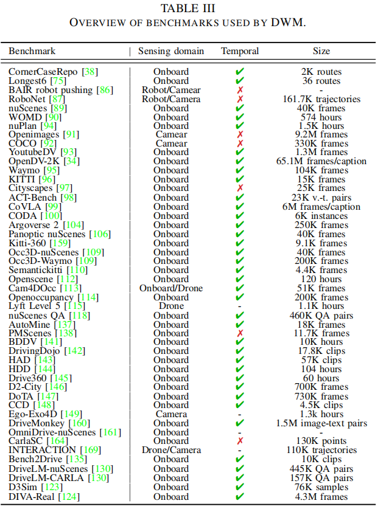
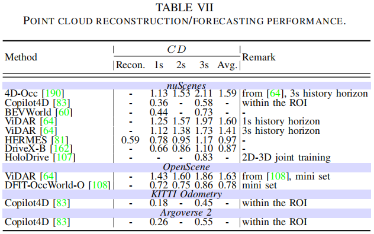
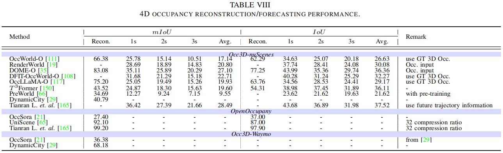
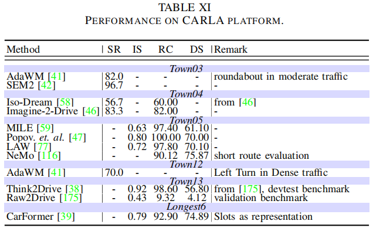
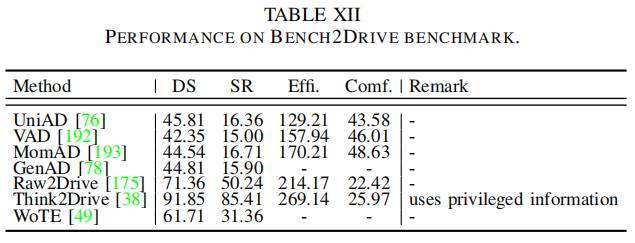
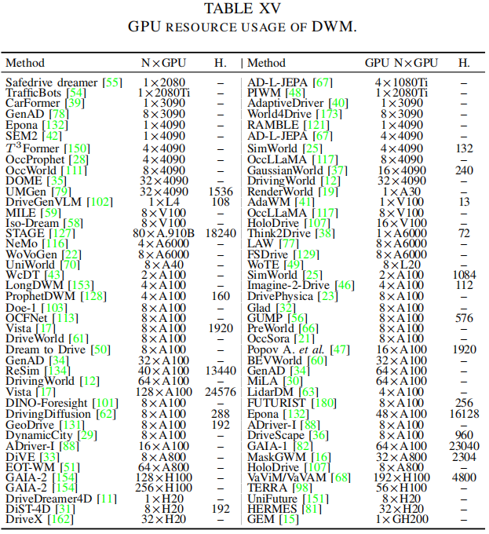

# 🔥 Awesome Robust Driving World Models 

This repository focuses on **driving world models (DWM)** with an emphasis on their **task taxonomy** and **progressive robustness (Robustness 1.0 → 3.0)**, base on the survey:

[[**Progressive Robustness-Aware World Models in Autonomous Driving: A Review and Outlook**](https://doi.org/10.36227/techrxiv.176523308.84756413/v1)]

## Citation

If you find this repository or the survey useful, please consider ⭐ this repo and citing the paper.

```bibtex
@article{jia2025progressive,
  title   = {Progressive Robustness-Aware World Models in Autonomous Driving: A Review and Outlook},
  author  = {Feiyang Jia and Caiyan Jia and Ziying Song and Zhicheng Bao and Lin Liu and Shaoqing Xu and Yan Gong and Lei Yang and Xinyu Zhang and Bin Sun and Xiaoshuai Hao and Long Chen and Yadan Luo},
  journal = {TechRxiv},
  year    = {2025},
  note    = {preprint},
  doi     = {10.36227/techrxiv.176523308.84756413/v1}
}
```

## Paper Recommendations 

If you’d like to suggest something, please open an new ISSUE page and (if possible) provide:

1. **Online link** to the paper / project homepage / code repository. 
2. The suggested **category**, following this repo:
   - Task: Generation / Planning / Enhancement
   - Robustness level: Robustness 1.0 / 2.0 / 3.0

---

# 📌 Overview of Contents

- 📄 1. Summary: Information, Task, and Robustness Level
- 🛡️ 2. Progressive Robustness Analysis: 1.0, 2.0 and 3.0
  - 2.1 Robustness 1.0 – Self-Metrics & Evaluation Protocols
  - 2.2 Robustness 2.0 – Contributions to Autonomous Driving Systems
  - 2.3 Robustness 3.0 – Open-World Robustness & Future Directions

---

# 📄 1. Summary: Information, Task, and Robustness Level

|            Abbr.            |   Pub.   | Full Title                                                                                                                         |                                                                           Paper                                                                           |                                       Page                                       |                                                Code                                                | Gene. | Plan. | Enh. | Lv. |
| :-------------------------: | :-------: | :--------------------------------------------------------------------------------------------------------------------------------- | :--------------------------------------------------------------------------------------------------------------------------------------------------------: | :------------------------------------------------------------------------------: | :------------------------------------------------------------------------------------------------: | :---: | :---: | :--: | :-: |
|     **Iso-Dream**     |  NIPS22  | Iso-dream: Isolating and leveraging noncontrollable visual dynamics in world models                                                |                 [[✓](https://proceedings.neurips.cc/paper_files/paper/2022/hash/9316769afaaeeaad42a9e3633b14e801-Abstract-Conference.html)]                 |                                        ✗                                        |                              [[✓](https://github.com/panmt/Iso-Dream)]                              |  ✓  |  ✓  |  ✗  | 1.0 |
|       **SEM2**       |  NIPS22  | Model-based imitation learning for urban driving                                                                                   |                                                           [[✓](https://arxiv.org/abs/2210.04017)]                                                           |                                        ✗                                        |                                                 ✗                                                 |  ✓  |  ✓  |  ✗  | 1.0 |
|       **MILE**       |  NIPS22  | SEM2: Enhance Sample Efficiency and Robustness of End-to-end Urban Autonomous Driving via Semantic Masked World Model              |                 [[✓](https://proceedings.neurips.cc/paper_files/paper/2022/hash/827cb489449ea216e4a257c47e407d18-Abstract-Conference.html)]                 |                                        ✗                                        |                                [[✓](https://github.com/wayveai/mile)]                                |  ✓  |  ✓  |  ✗  | 1.0 |
|     **ADriver-I**     |  arXiv23  | ADriver-I: A General World Model for Autonomous Driving                                                                            |                                                           [[✓](https://arxiv.org/abs/2311.13549)]                                                           |                                        ✗                                        |                                                 ✗                                                 |  ✓  |  ✓  |  ✗  | 1.0 |
|      **GAIA-1**      |  arXiv23  | GAIA-1: A Generative World Model for Autonomous Driving                                                                            |                                                           [[✓](https://arxiv.org/abs/2309.17080)]                                                           |                                        ✗                                        |                                                 ✗                                                 |  ✓  |  ✗  |  ✗  | 1.0 |
|     **UniWorld**     |  arXiv23  | UniWorld: Autonomous Driving Pre-training via World Models                                                                         |                                                           [[✓](https://arxiv.org/abs/2308.07234)]                                                           |                                        ✗                                        |                            [[✓](https://github.com/chaytonmin/UniWorld)]                            |  ✓  |  ✗  |  ✓  | 1.0 |
|    **TrafficBots**    |  ICRA23  | TrafficBots: Towards World Models for Autonomous Driving Simulation and Motion Prediction                                          |                                                           [[✓](https://arxiv.org/abs/2303.04116)]                                                           |                                        ✗                                        |                             [[✓](https://github.com/SysCV/TrafficBots)]                             |  ✓  |  ✓  |  ✗  | 2.0 |
|   **DrivingWorld**   |  arXiv24  | DrivingWorld: Constructing World Model for Autonomous Driving via Video GPT                                                        |                                                           [[✓](https://arxiv.org/abs/2412.19505)]                                                           |                                        ✗                                        |                            [[✓](https://github.com/YvanYin/DrivingWorld)]                            |  ✓  |  ✗  |  ✗  | 1.0 |
|   **InfinityDrive**   |  arXiv24  | InfinityDrive: Breaking Time Limits in Driving World Models                                                                        |                                                           [[✓](https://arxiv.org/abs/2412.01522)]                                                           |   [[✓](https://metadrivescape.github.io/papers_project/InfinityDrive/page.html)]   |                                                 ✗                                                 |  ✓  |  ✗  |  ✗  | 2.0 |
|       **GenAD**       |  CVPR24  | GenAD: Generalized Predictive Model for Autonomous Driving                                                                         |                                                           [[✓](https://arxiv.org/abs/2403.09630)]                                                           |                                        ✗                                        | [[✓](https://github.com/OpenDriveLab/DriveAGI?tab=readme-ov-file#genad-dataset-opendv-youtube)] |  ✓  |  ✓  |  ✗  | 2.0 |
|       **TERRA**       |  arXiv24  | ACT-Bench: Towards Action Controllable World Models for Autonomous Driving                                                         |                                                           [[✓](https://arxiv.org/abs/2412.05337)]                                                           |                  [[✓](https://turingmotors.github.io/actbench/)]                  |                           [[✓](https://github.com/turingmotors/ACT-Bench)]                           |  ✓  |  ✓  |  ✗  | 2.0 |
|       **Vista**       |  NIPS24  | Vista: A Generalizable Driving World Model with High Fidelity and Versatile Controllability                                        |                                                           [[✓](https://arxiv.org/abs/2405.17398)]                                                           |                                        ✗                                        |                             [[✓](https://github.com/OpenDriveLab/Vista)]                             |  ✓  |  ✓  |  ✗  | 2.0 |
|  **DINO-Foresight**  |  arXiv24  | DINO-Foresight: Self-Supervised Semantic Foresight for Autonomous Driving                                                          |                                                           [[✓](https://arxiv.org/abs/2412.11673)]                                                           |                                        ✗                                        |                           [[✓](https://github.com/Sta8is/DINO-Foresight)]                           |  ✓  |  ✗  |  ✗  | 1.0 |
|    **DriveGenVLM**    |  IAVVC24  | DriveGenVLM: Real-world Video Generation for Autonomous Driving with Vision Language Models                                        |                                                           [[✓](https://arxiv.org/abs/2408.16647)]                                                           |                                        ✗                                        |                                                 ✗                                                 |  ✓  |  ✗  |  ✗  | 1.0 |
|       **Doe-1**       |  arXiv24  | Doe-1: Driving on Earth with One Transformer                                                                                       |                                                           [[✓](https://arxiv.org/abs/2412.09627)]                                                           |                                        ✗                                        |                                [[✓](https://github.com/wzzheng/Doe)]                                |  ✓  |  ✓  |  ✗  | 1.0 |
|      **UniMLVG**      |  arXiv24  | UniMLVG: Unified Multi-View LiDAR-Video Generation for Autonomous Driving                                                          |                                                           [[✓](https://arxiv.org/abs/2412.09628)]                                                           |                  [[✓](https://sensetime-fvg.github.io/UniMLVG/)]                  |                           [[✓](https://github.com/SenseTime-FVG/OpenDWM)]                           |  ✓  |  ✗  |  ✗  | 1.0 |
|     **Drive-WM**     |  CVPR24  | Driving into the Future: Multiview Visual Forecasting and Planning with World Model for Autonomous Driving                         |                                                           [[✓](https://arxiv.org/abs/2311.17918)]                                                           |                         [[✓](https://drive-wm.github.io/)]                         |                            [[✓](https://github.com/BraveGroup/Drive-WM)]                            |  ✓  |  ✓  |  ✗  | 1.0 |
|   **DriveDreamer**   |  ECCV24  | DriveDreamer: Towards Real-world-driven Generative World Models for Autonomous Driving                                             |                                                           [[✓](https://arxiv.org/abs/2309.09777)]                                                           |                       [[✓](https://drivedreamer.github.io/)]                       |                          [[✓](https://github.com/JeffWang987/DriveDreamer)]                          |  ✓  |  ✓  |  ✓  | 2.0 |
| **DrivingDiffusion** |  ECCV24  | DrivingDiffusion: Layout-Guided multi-view driving scene video generation with latent diffusion model                              |                                                           [[✓](https://arxiv.org/abs/2310.07771)]                                                           |                     [[✓](https://drivingdiffusion.github.io/)]                     |                          [[✓](https://github.com/shalfun/DrivingDiffusion)]                          |  ✓  |  ✗  |  ✓  | 1.0 |
|   **DrivePhysica**   |  arXiv24  | DrivePhysica: Physical-Consistent Video Generation for Autonomous Driving                                                          |                                                           [[✓](https://arxiv.org/abs/2412.09621)]                                                           |                                        ✗                                        |            [[✓](https://metadrivescape.github.io/papers_project/DrivePhysica/page.html)]            |  ✓  |  ✗  |  ✓  | 2.0 |
|      **Panacea**      |  CVPR24  | Panacea: Panoramic and Controllable Video Generation for Autonomous Driving                                                        |                                                           [[✓](https://arxiv.org/abs/2311.16813)]                                                           |                        [[✓](https://panacea-ad.github.io/)]                        |                             [[✓](https://github.com/wenyuqing/panacea)]                             |  ✓  |  ✗  |  ✓  | 2.0 |
|    **DriveScape**    |  arXiv24  | DriveScape: Towards High-Resolution Controllable Multi-View Driving Video Generation                                               |                                                           [[✓](https://arxiv.org/abs/2409.05463)]                                                           |                                        ✗                                        |                                                 ✗                                                 |  ✓  |  ✗  |  ✓  | 1.0 |
|     **HoloDrive**     |  arXiv24  | HoloDrive: Holistic 2D-3D Multi-Modal Street Scene Generation for Autonomous Driving                                               |                                                           [[✓](https://arxiv.org/abs/2412.01407)]                                                           |                                        ✗                                        |                                                 ✗                                                 |  ✓  |  ✗  |  ✗  | 1.0 |
|      **WoVoGen**      |  ECCV24  | WoVoGen: World Volume-aware Diffusion for Controllable Multi-camera Driving Scene Generation                                       |                                                           [[✓](https://arxiv.org/abs/2312.02934)]                                                           |                                        ✗                                        |                             [[✓](https://github.com/fudan-zvg/WoVoGen)]                             |  ✓  |  ✗  |  ✗  | 1.0 |
|     **Copilot4D**     |  ICLR24  | Copilot4D: Learning Unsupervised World Models for Autonomous Driving via Discrete Diffusion                                        |                                                           [[✓](https://arxiv.org/abs/2311.01017)]                                                           |                                        ✗                                        |                                                 ✗                                                 |  ✓  |  ✗  |  ✗  | 1.0 |
|   **DFIT-OccWorld**   |  arXiv24  | An Efficient Occupancy World Model via Decoupled Dynamic Flow and Image-assisted Training                                          |                                                           [[✓](https://arxiv.org/abs/2412.13772)]                                                           |                                        ✗                                        |                                                 ✗                                                 |  ✓  |  ✓  |  ✗  | 1.0 |
|       **ViDAR**       |  CVPR24  | Visual Point Cloud Forecasting enables Scalable Autonomous Driving                                                                 |                                                           [[✓](https://arxiv.org/abs/2312.17655)]                                                           |                                        ✗                                        |                             [[✓](https://github.com/OpenDriveLab/ViDAR)]                             |  ✓  |  ✓  |  ✓  | 1.0 |
|        **UnO**        |  CVPR24  | UnO: Unsupervised Occupancy Fields for Perception and Forecasting                                                                  |                                                           [[✓](https://arxiv.org/abs/2406.08691)]                                                           |                        [[✓](https://waabi.ai/research/uno)]                        |                                 [[✓](https://waabi.ai/research/uno)]                                 |  ✓  |  ✗  |  ✓  | 1.0 |
|     **OccWorld**     |  ECCV24  | OccWorld: Learning a 3D Occupancy World Model for Autonomous Driving                                                               |                                                           [[✓](https://arxiv.org/abs/2311.16038)]                                                           |                        [[✓](https://wzzheng.net/OccWorld)]                        |                              [[✓](https://github.com/wzzheng/OccWorld)]                              |  ✓  |  ✓  |  ✗  | 1.0 |
|       **DOME**       |  arXiv24  | DOME: Taming Diffusion Model into High-Fidelity Controllable Occupancy World Model                                                 |                                                           [[✓](https://arxiv.org/abs/2410.10429)]                                                           |                       [[✓](https://gusongen.github.io/DOME)]                       |                               [[✓](https://github.com/gusongen/DOME)]                               |  ✓  |  ✗  |  ✗  | 1.0 |
|    **DriveWorld**    |  CVPR24  | DriveWorld: 4D Pre-trained Scene Understanding via World Models for Autonomous Driving                                             |                                                           [[✓](https://arxiv.org/abs/2405.04390)]                                                           |                                        ✗                                        |                                                 ✗                                                 |  ✓  |  ✓  |  ✓  | 2.0 |
|     **Cam4DOCC**     |  CVPR24  | Cam4DOcc: Benchmark for Camera-Only 4D Occupancy Forecasting in Autonomous Driving Applications                                    |                                                           [[✓](https://arxiv.org/abs/2311.17663)]                                                           |                                        ✗                                        |                             [[✓](https://github.com/haomo-ai/Cam4DOcc)]                             |  ✓  |  ✗  |  ✗  | 1.0 |
|      **OccSora**      |  arXiv24  | OccSora: 4D Occupancy Generation Models as World Simulators for Autonomous Driving                                                 |                                                           [[✓](https://arxiv.org/abs/2405.17833)]                                                           |                                        ✗                                        |                             [[✓](https://github.com/haomo-ai/Cam4DOcc)]                             |  ✓  |  ✗  |  ✗  | 1.0 |
|       **NeMo**       |  ECCV24  | Neural Volumetric World Models for Autonomous Driving                                                                              |                                          [[✓](https://www.ecva.net/papers/eccv_2024/papers_ECCV/papers/02571.pdf)]                                          |                                        ✗                                        |                                                 ✗                                                 |  ✓  |  ✓  |  ✓  | 1.0 |
|     **OccLLaMA**     |  arXiv24  | OccLLaMA: An Occupancy-Language-Action Generative World Model for Autonomous Driving                                               |                                                           [[✓](https://arxiv.org/abs/2409.03272)]                                                           |                                        ✗                                        |                                                 ✗                                                 |  ✓  |  ✓  |  ✗  | 1.0 |
|        **LAW**        |  arXiv24  | Enhancing End-to-end Autonomous Driving with Latent World Model                                                                    |                                                           [[✓](https://arxiv.org/abs/2406.08481)]                                                           |                                        ✗                                        |                               [[✓](https://github.com/BraveGroup/LAW)]                               |  ✓  |  ✓  |  ✗  | 2.0 |
|     **CarFormer**     |  ECCV24  | CarFormer: Self-Driving with Learned Object-Centric Representations                                                                |                                                           [[✓](https://arxiv.org/abs/2407.15843)]                                                           |                    [[✓](https://kuis-ai.github.io/CarFormer/)]                    |                            [[✓](https://github.com/Shamdan17/CarFormer)]                            |  ✓  |  ✓  |  ✗  | 2.0 |
|       **GenAD**       |  ECCV24  | GenAD: Generative End-to-End Autonomous Driving                                                                                    |                                                           [[✓](https://arxiv.org/abs/2402.11502)]                                                           |                                        ✗                                        |                               [[✓](https://github.com/wzzheng/GenAD)]                               |  ✓  |  ✓  |  ✓  | 1.0 |
|   **SceneDiffuser**   |  NIPS24  | SceneDiffuser: Efficient and Controllable Driving Simulation Initialization and Rollout                                            |                                                           [[✓](https://arxiv.org/abs/2412.12129)]                                                           |                                        ✗                                        |                                                 ✗                                                 |  ✓  |  ✓  |  ✗  | 1.0 |
|     **MARL-CCE**     |  ECCV24  | Modelling Competitive Behaviors in Autonomous Driving Under Generative World Model                                                 |                                          [[✓](https://www.ecva.net/papers/eccv_2024/papers_ECCV/papers/05085.pdf)]                                          |                                        ✗                                        |                            [[✓](https://github.com/qiaoguanren/MARL-CCE)]                            |  ✓  |  ✗  |  ✗  | 1.0 |
|      **RAMBLE**      |  arXiv24  | From Imitation to Exploration: End-to-end Autonomous Driving based on World Model                                                  |                                                           [[✓](https://arxiv.org/abs/2410.02253)]                                                           |                                        ✗                                        |                                                 ✗                                                 |  ✓  |  ✓  |  ✗  | 2.0 |
|  **Imagine-2-Drive**  |  arXiv24  | Imagine-2-Drive: High-Fidelity World Modeling in CARLA for Autonomous Vehicles                                                     |                                                           [[✓](https://arxiv.org/abs/2411.10171)]                                                           |           [[✓](https://anantagrg.github.io/Imagine-2-Drive.github.io/)]           |                                                 ✗                                                 |  ✓  |  ✗  |  ✗  | 2.0 |
|              -              |  arXiv24  | Mitigating Covariate Shift in Imitation Learning for Autonomous Vehicles Using Latent Space Generative World Models                |                                                           [[✓](https://arxiv.org/abs/2409.16663)]                                                           |                                        ✗                                        |                                                 ✗                                                 |  ✓  |  ✓  |  ✗  | 1.0 |
|    **Think2Drive**    |  ECCV24  | Think2Drive: Efficient Reinforcement Learning by Thinking in Latent World Model for Quasi-Realistic Autonomous Driving             |                                                           [[✓](https://arxiv.org/abs/2402.16720)]                                                           |                                        ✗                                        |                                                 ✗                                                 |  ✓  |  ✓  |  ✗  | 2.0 |
|       **GUMP**       |  ECCV24  | Solving Motion Planning Tasks with a Scalable Generative Model                                                                     |                                                           [[✓](https://arxiv.org/abs/2407.02797)]                                                           |                                        ✗                                        |                           [[✓](https://github.com/HorizonRobotics/GUMP/)]                           |  ✓  |  ✓  |  ✗  | 1.0 |
|     **Dreamland**     |  arXiv25  | Dreamland: Controllable World Creation with Simulator and Generative Models                                                        |                                                           [[✓](https://arxiv.org/abs/2506.08006)]                                                           |                  [[✓](https://metadriverse.github.io/dreamland/)]                  |                                                 ✗                                                 |  ✓  |  ✗  |  ✗  | 2.0 |
|       **Orbis**       |  arXiv25  | Orbis: Overcoming Challenges of Long-Horizon Prediction in Driving World Models                                                    |                                                           [[✓](https://arxiv.org/abs/2507.13162)]                                                           |                                        ✗                                        |                             [[✓](https://github.com/lmb-freiburg/Orbis)]                             |  ✓  |  ✗  |  ✗  | 2.0 |
|       **STAGE**       |  IROS25  | STAGE: A Stream-Centric Generative World Model for Long-Horizon Driving-Scene Simulation                                           |                                                           [[✓](https://arxiv.org/abs/2506.13138)]                                                           |                       [[✓](https://4dvlab.github.io/STAGE/)]                       |                                                 ✗                                                 |  ✓  |  ✗  |  ✗  | 2.0 |
|     **DriVerse**     | ACM MM25 | DriVerse: Navigation World Model for Driving Simulation via Multimodal Trajectory Prompting and Motion Alignment                   |                                                           [[✓](https://arxiv.org/abs/2504.18576)]                                                           |                                        ✗                                        |                              [[✓](https://github.com/shalfun/DriVerse)]                              |  ✓  |  ✗  |  ✗  | 2.0 |
|   **ReconDreamer**   |  CVPR25  | ReconDreamer: Crafting World Models for Driving Scene Reconstruction via Online Restoration                                        |                                                           [[✓](https://arxiv.org/abs/2411.19548)]                                                           |                                        ✗                                        |                        [[✓](https://github.com/GigaAI-research/ReconDreamer)]                        |  ✓  |  ✗  |  ✗  | 1.0 |
|    **ProphetDWM**    |  arXiv25  | ProphetDWM: A Driving World Model for Rolling Out Future Actions and Videos                                                        |                                                           [[✓](https://arxiv.org/abs/2505.18650)]                                                           |                                        ✗                                        |                                                 ✗                                                 |  ✓  |  ✗  |  ✗  | 1.0 |
|      **FSDrive**      | NeurIPS25 | FutureSightDrive: Thinking Visually with Spatio-Temporal CoT for Autonomous Driving                                                |                                                           [[✓](https://arxiv.org/abs/2505.17685)]                                                           |                                        ✗                                        |                              [[✓](https://github.com/MIV-XJTU/FSDrive)]                              |  ✓  |  ✓  |  ✗  | 2.0 |
|    **DrivingGPT**    |  ICCV25  | DrivingGPT: Unifying Driving World Modeling and Planning with Multi-modal Autoregressive Transformers                              |                                                           [[✓](https://arxiv.org/abs/2412.18607)]                                                           |                  [[✓](https://rogerchern.github.io/DrivingGPT/)]                  |                                                 ✗                                                 |  ✓  |  ✓  |  ✗  | 1.0 |
|     **GeoDrive**     |  arXiv25  | GeoDrive: 3D Geometry-Informed Driving World Model with Precise Action Control                                                     |                                                           [[✓](https://arxiv.org/abs/2505.22421)]                                                           |                                        ✗                                        |                            [[✓](https://github.com/antonioo-c/GeoDrive)]                            |  ✓  |  ✓  |  ✗  | 2.0 |
|       **Epona**       |  ICCV25  | Epona: Autoregressive Diffusion World Model for Autonomous                                                                         |                                                           [[✓](https://arxiv.org/abs/2506.24113)]                                                           |                     [[✓](https://kevin-thu.github.io/Epona/)]                     |                              [[✓](https://github.com/Kevin-thu/Epona)]                              |  ✓  |  ✓  |  ✗  | 3.0 |
|    **ImagiDrive**    |  arXiv25  | ImagiDrive: A Unified Imagination-and-Planning Framework for Autonomous Driving                                                    |                                                           [[✓](https://arxiv.org/abs/2508.11428)]                                                           |                                        ✗                                        |                            [[✓](https://github.com/fudan-zvg/ImagiDrive)]                            |  ✓  |  ✓  |  ✗  | 2.0 |
|       **ReSim**       |  arXiv25  | ReSim: Reliable World Simulation for Autonomous Driving                                                                            |                                                           [[✓](https://arxiv.org/abs/2506.09981)]                                                           |                       [[✓](https://opendrivelab.com/ReSim)]                       |                             [[✓](https://github.com/OpenDriveLab/ReSim)]                             |  ✓  |  ✓  |  ✗  | 2.0 |
|    **VaViM/VaVAM**    |  arXiv25  | VaViM and VaVAM: Autonomous Driving through Video Generative Modeling                                                              |                                                           [[✓](https://arxiv.org/abs/2502.15672)]                                                           |                   [[✓](https://valeoai.github.io/vavim-vavam/)]                   |                          [[✓](https://github.com/valeoai/VideoActionModel)]                          |  ✓  |  ✓  |  ✓  | 2.0 |
|  **DriveDreamer4D**  |  CVPR25  | DriveDreamer4D: World Models Are Effective Data Machines for 4D Driving Scene Representation                                       |                                                           [[✓](https://arxiv.org/abs/2410.13571)]                                                           |                      [[✓](https://drivedreamer4d.github.io/)]                      |                       [[✓](https://github.com/GigaAI-research/DriveDreamer4D)]                       |  ✓  |  ✓  |  ✗  | 2.0 |
|     **Drive&Gen**     |  IROS25  | Drive&Gen: Co-Evaluating End-to-End Driving and Video Generation Models                                                            |                                                           [[✓](https://arxiv.org/abs/2510.06209)]                                                           |                                        ✗                                        |                                                 ✗                                                 |  ✓  |  ✓  |  ✓  | 3.0 |
|     **SimWorld**     |  arXiv25  | SimWorld: A Unified Benchmark for Simulator-Conditioned Scene Generation via World Model                                           |                                                           [[✓](https://arxiv.org/abs/2503.13952)]                                                           |                                        ✗                                        |                              [[✓](https://github.com/Li-Zn-H/SimWorld)]                              |  ✓  |  ✗  |  ✓  | 2.0 |
|       **UMGen**       |  CVPR25  | Generating Multimodal Driving Scenes via Next-Scene Prediction                                                                     |                                                           [[✓](https://arxiv.org/abs/2503.14945)]                                                           |                      [[✓](https://yanhaowu.github.io/UMGen/)]                      |                              [[✓](https://github.com/YanhaoWu/UMGen/)]                              |  ✓  |  ✗  |  ✗  | 2.0 |
|    **InfiniCube**    |  ICCV25  | InfiniCube: Unbounded and Controllable Dynamic 3D Driving Scene Generation with World-Guided Video Models                          |                                                           [[✓](https://arxiv.org/abs/2412.03934)]                                                           |           [[✓](https://research.nvidia.com/labs/toronto-ai/infinicube/)]           |                            [[✓](https://github.com/nv-tlabs/InfiniCube)]                            |  ✓  |  ✗  |  ✗  | 1.0 |
|        **GEM**        |  CVPR25  | GEM: A Generalizable Ego-Vision Multimodal World Model for Fine-Grained Ego-Motion, Object Dynamics, and Scene Composition Control |                                                           [[✓](https://arxiv.org/abs/2412.11198)]                                                           |                 [[✓](https://vita-epfl.github.io/GEM.github.io/)]                 |                               [[✓](https://github.com/vita-epfl/GEM)]                               |  ✓  |  ✓  |  ✗  | 2.0 |
|     **$T^3$Former**     |  arXiv25  | Delta-Triplane Transformers as Occupancy World Models                                                                              |                                                           [[✓](https://arxiv.org/abs/2503.07338)]                                                           |                                        ✗                                        |                                                 ✗                                                 |  ✓  |  ✓  |  ✗  | 1.0 |
|       **MUVO**       |  IV25  | MUVO: A Multimodal Generative World Model for Autonomous Driving with Geometric Representations                                    |                                                           [[✓](https://arxiv.org/abs/2311.11762)]                                                           |                                        ✗                                        |                                                 ✗                                                 |  ✓  |  ✗  |  ✓  | 2.0 |
|     **UniFuture**     |  arXiv25  | Seeing the Future, Perceiving the Future: A Unified Driving World Model for Future Generation and Perception                       |                                                           [[✓](https://arxiv.org/abs/2503.13587)]                                                           |                    [[✓](https://dk-liang.github.io/UniFuture/)]                    |                             [[✓](https://github.com/dk-liang/UniFuture)]                             |  ✓  |  ✗  |  ✗  | 2.0 |
|     **Cosmos-7B**     |  arXiv25  | Cosmos-Drive-Dreams: Scalable Synthetic Driving Data Generation with World Foundation Models                                      |                                                           [[✓](https://arxiv.org/abs/2506.09042)]                                                           |      [[✓](https://research.nvidia.com/labs/toronto-ai/cosmos_drive_dreams/)]      |                        [[✓](https://github.com/nv-tlabs/Cosmos-Drive-Dreams)]                        |  ✓  |  ✗  |  ✓  | 3.0 |
|      **MaskGWM**      |  CVPR25  | MaskGWM: Masked Generative World Model for Autonomous Driving                                                                      |                                                           [[✓](https://arxiv.org/abs/2500.00000)]                                                           |                                        ✗                                        |                                                 ✗                                                 |  ✓  |  ✗  |  ✗  | 2.0 |
|  **DriveDreamer-2**  |  AAAI25  | DriveDreamer-2: LLM-Enhanced World Models for Autonomous Driving                                                                   |                                                           [[✓](https://arxiv.org/abs/2403.06845)]                                                           |                      [[✓](https://drivedreamer-2.github.io/)]                      |                        [[✓](https://github.com/DriveDreamer/DriveDreamer-2)]                        |  ✓  |  ✗  |  ✓  | 2.0 |
|       **MiLA**       |  arXiv25  | MiLA: Multi-View Long-Horizon Autonomous Driving Video Generation                                                                  |                                                           [[✓](https://arxiv.org/abs/2503.15875)]                                                           |                                        ✗                                        |                                                 ✗                                                 |  ✓  |  ✗  |  ✗  | 2.0 |
|      **LongDWM**      |  arXiv25  | LongDWM: Cross-Granularity Distillation for Building a Long-Term Driving World Model                                               |                                                           [[✓](https://arxiv.org/abs/2506.01546)]                                                           |                [[✓](https://wang-xiaodong1899.github.io/longdwm/)]                |                         [[✓](https://github.com/Wang-Xiaodong1899/Long-DWM)]                         |  ✓  |  ✗  |  ✗  | 2.0 |
|      **GAIA-2**      |  arXiv25  | GAIA-2: A Generalist Generative World Model for Autonomous Driving (Wayve)                                                         |                                                           [[✓](https://arxiv.org/abs/2503.20523)]                                                           |                      [[✓](https://wayve.ai/thinking/gaia-2/)]                      |                                                 ✗                                                 |  ✓  |  ✗  |  ✗  | 2.0 |
|    **MoVieDrive**    |  arXiv25  | MoVieDrive: Multi-Modal Multi-View Urban Scene Video Generation                                                                    |                                                           [[✓](https://arxiv.org/abs/2508.14327)]                                                           |                                        ✗                                        |                                                 ✗                                                 |  ✓  |  ✓  |  ✗  | 2.0 |
|   **DrivingSphere**   |  CVPR25  | DrivingSphere: Building a High-fidelity 4D World for Closed-loop Simulation                                                        |                                                           [[✓](https://arxiv.org/abs/2411.11252)]                                                           |                  [[✓](https://yanty123.github.io/DrivingSphere/)]                  |                           [[✓](https://github.com/yanty123/DrivingSphere)]                           |  ✓  |  ✓  |  ✗  | 2.0 |
|       **Glad**       |  ICLR25  | Glad: A Streaming Scene Generator for Autonomous Driving                                                                           |                                                           [[✓](https://arxiv.org/abs/2503.00045)]                                                           |                                        ✗                                        |                                 [[✓](https://github.com/xb534/Glad)]                                 |  ✓  |  ✗  |  ✓  | 2.0 |
|       **DiVE**       |  ICLR25  | DiVE: Efficient Multi-View Driving Scenes Generation Based on Video Diffusion Transformer                                          |                                                           [[✓](https://arxiv.org/abs/2504.19614)]                                                           |                                        ✗                                        |                                                 ✗                                                 |  ✓  |  ✗  |  ✓  | 2.0 |
|     **CVD-STORM**     |  arXiv25  | CVD-STORM: Cross-View Video Diffusion with Spatial-Temporal Reconstruction Model for Autonomous Driving                            |                                                           [[✓](https://arxiv.org/abs/2510.07944)]                                                           |                                        ✗                                        |                                                 ✗                                                 |  ✓  |  ✗  |  ✓  | 2.0 |
|      **DiST-4D**      |  ICCV25  | Disentangled Spatiotemporal Diffusion with Metric Depth for 4D Driving Scene Generation                                            |                                                           [[✓](https://arxiv.org/abs/2503.15208)]                                                           |                  [[✓](https://royalmelon0505.github.io/DiST-4D/)]                  |                           [[✓](https://github.com/royalmelon0505/dist4d)]                           |  ✓  |  ✗  |  ✗  | 2.0 |
|     **PhiGensis**     |  arXiv25  | 4D Driving Scene Generation With Stereo Forcing                                                                                    |                                                           [[✓](https://arxiv.org/abs/2509.20251)]                                                           |                   [[✓](https://jiangxb98.github.io/PhiGensis/)]                   |                             [[✓](https://github.com/LuPaoPao/PhiGensis)]                             |  ✓  |  ✓  |  ✓  | 3.0 |
|      **EOT-WM**      |  arXiv25  | Other Vehicle Trajectories Are Also Needed: A Driving World Model Unifies Ego-Other Vehicle Trajectories in Video Latant Space     |                                                           [[✓](https://arxiv.org/abs/2503.09215)]                                                           |                                        ✗                                        |                                                 ✗                                                 |  ✓  |  ✗  |  ✗  | 2.0 |
|     **BEVWorld**     |  ICLR25  | BEVWorld: A Multimodal World Model for Autonomous Driving via Unified BEV Latent Space                                             |                                                           [[✓](https://arxiv.org/abs/2407.05679)]                                                           |                                        ✗                                        |                             [[✓](https://github.com/zympsyche/BevWorld)]                             |  ✓  |  ✓  |  ✓  | 2.0 |
|     **UniScene**     |  CVPR25  | UniScene: Unified Occupancy-centric Driving Scene Generation                                                                       |                                                           [[✓](https://arxiv.org/abs/2412.05435)]                                                           |                     [[✓](https://arlo0o.github.io/uniscene/)]                     |     [[✓](https://github.com/Arlo0o/UniScene-Unified-Occupancy-centric-Driving-Scene-Generation)]     |  ✓  |  ✗  |  ✓  | 1.0 |
|         **-**         |  ICCVW25  | Learning to Generate 4D LiDAR Sequences                                                                                            |                                                           [[✓](https://arxiv.org/abs/2509.11959)]                                                           |                                        ✗                                        |                                                 ✗                                                 |  ✓  |  ✗  |  ✗  | 1.0 |
|   **LiDARCrafter**   |  arXiv25  | LiDARCrafter: Dynamic 4D World Modeling from LiDAR Sequences                                                                       |                                                           [[✓](https://arxiv.org/abs/2508.03692)]                                                           |                       [[✓](https://lidarcrafter.github.io/)]                       |                          [[✓](https://github.com/worldbench/LiDARCrafter)]                          |  ✓  |  ✓  |  ✗  | 2.0 |
|      **LidarDM**      |  ICRA25  | LidarDM: Generative LiDAR Simulation in a Generated World                                                                          |                                                [[✓](https://ieeexplore.ieee.org/abstract/document/11128001)]                                                |                                        ✗                                        |                                                 ✗                                                 |  ✓  |  ✗  |  ✓  | 2.0 |
|      **HERMES**      |  ICCV25  | HERMES: A Unified Self-Driving World Model for Simultaneous 3D Scene Understanding and Generation                                  |                                                           [[✓](https://arxiv.org/abs/2501.14729)]                                                           |                      [[✓](https://lmd0311.github.io/HERMES/)]                      |                               [[✓](https://github.com/LMD0311/HERMES)]                               |  ✓  |  ✓  |  ✗  | 3.0 |
|      **DriveX**      |  arXiv25  | DriveX: Omni Scene Modeling for Learning Generalizable World Knowledge in Autonomous Driving                                       |                                                           [[✓](https://arxiv.org/abs/2505.19239)]                                                           |                                        ✗                                        |                                                 ✗                                                 |  ✓  |  ✓  |  ✗  | 2.0 |
|        **DIO**        |  CVPR25  | DIO: Decomposable Implicit 4D Occupancy-Flow World Model                                                                           |        [[✓](https://openaccess.thecvf.com/content/CVPR2025/html/Diehl_DIO_Decomposable_Implicit_4D_Occupancy-Flow_World_Model_CVPR_2025_paper.html)]        |                                        ✗                                        |                                                 ✗                                                 |  ✓  |  ✗  |  ✓  | 2.0 |
|   **GaussianWorld**   |  CVPR25  | GaussianWorld: Gaussian World Model for Streaming 3D Occupancy Prediction                                                          |                                                           [[✓](https://arxiv.org/abs/2412.10373)]                                                           |                                        ✗                                        |                           [[✓](https://github.com/zuosc19/GaussianWorld)]                           |  ✓  |  ✗  |  ✗  | 2.0 |
|    **DynamicCity**    |  ICLR25  | DynamicCity: Large-Scale 4D Occupancy Generation from Dynamic Scenes                                                               |                                                           [[✓](https://arxiv.org/abs/2410.18084)]                                                           |                                        ✗                                        |                            [[✓](https://github.com/3DTopia/DynamicCity)]                            |  ✓  |  ✗  |  ✗  | 1.0 |
|    **OccProphet**    |  ICLR25  | OccProphet: Pushing Efficiency Frontier of Camera-Only 4D Occupancy Forecasting with Observer-Forecaster-Refiner Framework         |                                                           [[✓](https://arxiv.org/abs/2502.15180)]                                                           |                                        ✗                                        |                            [[✓](https://github.com/JLChen-C/OccProphet)]                            |  ✓  |  ✗  |  ✗  | 1.0 |
| **-** |  arXiv25  | Towards Foundational LiDAR World Models with Efficient Latent Flow Matching                                                        |                                                           [[✓](https://arxiv.org/abs/2506.23434)]                                                           |                                        ✗                                        |                                                 ✗                                                 |  ✓  |  ✗  |  ✗  | 1.0 |
|     **PreWorld**     |  ICLR25  | Semi-Supervised Vision-Centric 3D Occupancy World Model for Autonomous Driving                                                     |                                                           [[✓](https://arxiv.org/abs/2502.07309)]                                                           |                                        ✗                                        |                            [[✓](https://github.com/getterupper/PreWorld)]                            |  ✓  |  ✓  |  ✗  | 2.0 |
|  **Drive-OccWorld**  |  AAAI25  | Driving in the Occupancy World: Vision-Centric 4D Occupancy Forecasting and Planning via World Models for Autonomous Driving       |                                                           [[✓](https://arxiv.org/abs/2408.14197)]                                                           |                      [[✓](https://drive-occworld.github.io/)]                      |                        [[✓](https://github.com/yuyang-cloud/Drive-OccWorld)]                        |  ✓  |  ✓  |  ✗  | 2.0 |
|      **OccTENS**      |  arXiv25  | OccTENS: 3D Occupancy World Model via Temporal Next-Scale Prediction                                                               |                                                           [[✓](https://arxiv.org/abs/2509.03887)]                                                           |                                        ✗                                        |                                                 ✗                                                 |  ✓  |  ✓  |  ✗  | 2.0 |
|    **RenderWorld**    |  ICRA25  | RenderWorld: World Model with Self-Supervised 3D Label                                                                             |                                                           [[✓](https://arxiv.org/abs/2409.11356)]                                                           |                                        ✗                                        |                                                 ✗                                                 |  ✓  |  ✓  |  ✗  | 2.0 |
|     **$I^2$-World**     |  arXiv25  | Intra-Inter Tokenization for Efficient Dynamic 4D Scene Forecasting                                                                |                                                           [[✓](https://arxiv.org/abs/2507.09144)]                                                           |                                        ✗                                        |                              [[✓](https://github.com/lzzzzzm/II-World)]                              |  ✓  |  ✗  |  ✓  | 2.0 |
|      **Occ-LLM**      |  ICRA25  | Occ-LLM: Enhancing Autonomous Driving with Occupancy-Based Large Language Models                                                  |                                                           [[✓](https://arxiv.org/abs/2502.06419)]                                                           |                                        ✗                                        |                                                 ✗                                                 |  ✓  |  ✓  |  ✗  | 2.0 |
|        **CTT**        |  ICRA25  | Categorical Traffic Transformer: Interpretable and Diverse Behavior Prediction with Tokenized Latent                               |                                                           [[✓](https://arxiv.org/abs/2311.18307)]                                                           |                                        ✗                                        |                                                 ✗                                                 |  ✓  |  ✓  |  ✗  | 1.0 |
|       **PIWM**       |   TIV25   | Dream to Drive with Predictive Individual World Model                                                                              |                                                           [[✓](https://arxiv.org/abs/2501.16733)]                                                           |                                        ✗                                        |                              [[✓](https://github.com/gaoyinfeng/PIWM)]                              |  ✓  |  ✓  |  ✗  | 1.0 |
|  **Dream to Drive**  |  arXiv25  | Dream to Drive: Model-Based Vehicle Control Using Analytic World Models                                                            |                                                           [[✓](https://arxiv.org/abs/2502.10012)]                                                           |                                        ✗                                        |                                                 ✗                                                 |  ✓  |  ✓  |  ✗  | 2.0 |
|       **WoTE**       |  ICCV25  | End-to-End Driving with Online Trajectory Evaluation via BEV World Model                                                           |                                                           [[✓](https://arxiv.org/abs/2504.01941)]                                                           |                                        ✗                                        |                             [[✓](https://github.com/liyingyanUCAS/WoTE)]                             |  ✓  |  ✓  |  ✗  | 2.0 |
|  **SceneDiffuser++**  |  CVPR25  | SceneDiffuser++: City-Scale Traffic Simulation via a Generative World Model                                                        | [[✓](https://openaccess.thecvf.com/content/CVPR2025/html/Tan_SceneDiffuser_City-Scale_Traffic_Simulation_via_a_Generative_World_Model_CVPR_2025_paper.html)] |                                        ✗                                        |                                                 ✗                                                 |  ✓  |  ✓  |  ✗  | 2.0 |
|  **AdaptiveDriver**  |  ICRA25  | Planning with Adaptive World Models for Autonomous Driving                                                                         |                                                           [[✓](https://arxiv.org/abs/2406.10714)]                                                           | [[✓](https://arunbalajeev.github.io/world_models_planning/world_model_paper.html)] |                                                 ✗                                                 |  ✓  |  ✓  |  ✗  | 2.0 |
|   **LatentDriver**   |  ICRA25  | Learning Multiple Probabilistic Decisions from Latent World Model in Autonomous Driving                                            |                                                           [[✓](https://arxiv.org/abs/2409.15730)]                                                           |                                        ✗                                        |                          [[✓](https://github.com/Sephirex-X/LatentDriver)]                          |  ✓  |  ✓  |  ✗  | 2.0 |
| **Safedrive Dreamer** |   AEJ25   | Safedrive dreamer: Navigating safety–critical scenarios in autonomous driving with world models                                   |                                                                           [[✓]()]                                                                           |                                        ✗                                        |                                                 ✗                                                 |  ✓  |  ✗  |  ✓  | 2.0 |
|    **World4Drive**    |  ICCV25  | World4Drive: End-to-End Autonomous Driving via Intention-aware Physical Latent World Model                                         |                                                           [[✓](https://arxiv.org/abs/2507.00603)]                                                           |                                        ✗                                        |                                                 ✗                                                 |  ✓  |  ✓  |  ✗  | 2.0 |
|       **WcDT**       |  ICRA25  | End-to-End Driving with Online Trajectory Evaluation via BEV World Model                                                           |                                                                           [[✓]()]                                                                           |                                        ✗                                        |                               [[✓](https://arxiv.org/abs/2504.01941)]                               |  ✓  |  ✓  |  ✗  | 2.0 |
|     **FASTopoWM**     |  arXiv25  | FASTopoWM: Fast-Slow Lane Segment Topology Reasoning with World Models                                                             |                                                           [[✓](https://arxiv.org/abs/2507.23325)]                                                           |                                        ✗                                        |                                                 ✗                                                 |  ✓  |  ✓  |  ✓  | 2.0 |
|       **AdaWM**       |  CVPR25  | AdaWM: Adaptive World Model based Planning for Autonomous Driving                                                                  |                                                           [[✓](https://arxiv.org/abs/2501.13072)]                                                           |                                        ✗                                        |                                                 ✗                                                 |  ✓  |  ✓  |  ✗  | 2.0 |
|     **Raw2Drive**     |  arXiv25  | Raw2Drive: Reinforcement Learning with Aligned World Models for End-to-End Autonomous Driving                                      |                                                           [[✓](https://arxiv.org/abs/2505.16394)]                                                           |                                        ✗                                        |                                                 ✗                                                 |  ✓  |  ✓  |  ✗  | 3.0 |
|      **VL-SAFE**      |  arXiv25  | VL-SAFE: Vision-Language Guided Safety-Aware Reinforcement Learning with World Models for Autonomous Driving                       |                                                           [[✓](https://arxiv.org/abs/2505.16377)]                                                           |                   [[✓](https://ys-qu.github.io/vlsafe-website/)]                   |                          [[✓](https://github.com/ys-qu/vl-safe/tree/main)]                          |  ✓  |  ✓  |  ✗  | 2.0 |
|      **LSD-3D**      |  arXiv25  | LSD-3D: Large-Scale 3D Driving Scene Generation with Geometry Grounding                                                            |                                                           [[✓](https://arxiv.org/abs/2508.19204)]                                                           |          [[✓](https://princeton-computational-imaging.github.io/LSD-3D/)]          |                                                 ✗                                                 |  ✓  |  ✗  |  ✗  | 2.0 |
|     **FUTURIST**     |  arXiv25  | FUTURIST: Advancing Semantic Future Prediction through Multimodal Visual Sequence Transformers                                     |                                                           [[✓](https://arxiv.org/abs/2501.08303)]                                                           |                                        ✗                                        |                              [[✓](https://github.com/Sta8is/FUTURIST)]                              |  ✓  |  ✗  |  ✗  | 2.0 |
|     **AD-L-JEPA**     |  arXiv25  | Self-Supervised Spatial World Models with Joint Embedding Predictive Architecture for Autonomous Driving with LiDAR Data           |                                                           [[✓](https://arxiv.org/abs/2501.04969)]                                                           |                                        ✗                                        |                    [[✓](https://github.com/HaoranZhuExplorer/AD-L-JEPA-Release)]                    |  ✓  |  ✗  |  ✓  | 2.0 |

---

# 🛡️ 2. Progressive Robustness Analysis: 1.0, 2.0 and 3.0

## 2.1 Robustness 1.0 – Self-Metrics & Evaluation Protocols













## 2.2 Robustness 2.0 – Contributions to Autonomous Driving Systems


## 2.3 Robustness 3.0 – Open-World Robustness & Future Directions


